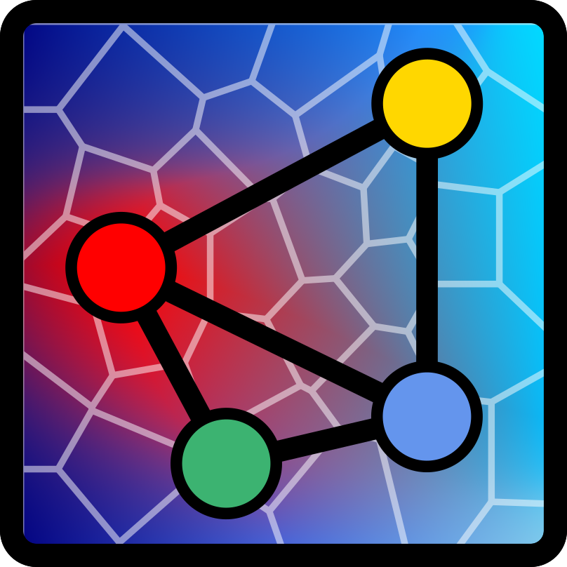



In **February 2026**, I started a new position as an assistant professor in the 
[**Department of Materials Engineering**][dema] at the
[**Federal University of São Carlos (UFSCar)**][ufscar]. It was a **dream** that
came true. With that comes the **opportunity** (and **responsibility**) of
starting my own research group: The **Transport Phenomena in Materials Team (TPMaT)**.

<video class="tpmat-logo-video" id="logo-video" autoplay muted playsinline>
<source src="../../videos/logo-tpmat.mp4" type="video/mp4">
</video>

When I was an undergraduate researcher I studied the application of
**statistical models** in refractory materials. It was the first time that I
heard about the **_"reproducibility crisis"_** in science. From that moment I
knew that I wanted to conduct research in a way that was
<i class="fa-solid fa-repeat"></i> **reproducible**
 Research that anyone can repeat. ,
<i class="fa-solid fa-universal-access"></i> **inclusive**
 Research that anyone can verify and build upon. , and 
<i class="fa-solid fa-box-open"></i> **open**
 Research that anyone can access and use. . 

I also grew to the realization that such an environment would enable me to 
**teach** and **mentor** students in a way that would help them become **better
scientists** and **engineers**.

In addition, during my academic career I learned all the **costs** and
**challenges** of the **typical experimental research** usually carried out in
Materials Science and Engineering labs. In parallel, I also uncovered a **deep
interest** and **joy** in using **computational methods**. That made it crystal
clear that if I ever was to start a lab group, I would rather focus on 
computational methods and open science, while also being able to collaborate 
with more experienced **experimentalists** and **applied scientists**.

During my PhD I also had my **first experience** at a **large-scale research
facility** at the [Institut Laue-Langevin (ILL)][ILL] in Grenoble, where we
could visualize **transport phenomena** in materials in **real time**
using **neutron imaging**. This experience was pivotal and made me realize
that I wanted to continue working at the **intersection** of **computational
methods** and **advanced experimental research**, particularly focusing on 
**full-field imaging.**

While preparing myself for examination boards and interviews for faculty
positions, I realized that the subject that I was researching for the past 10
years, the **drying of refractory castables**, was actually a specific case of
a broader class of problems in **transport phenomena** in complex and evolving
microstructures. That was when it clicked for me: **Drying**, **shaping**,
**additive manufacturing**, and **sintering** are all crucial topics
in **materials engineering** that are controlled by **transport phenomena**.

**_Why we believe now is the right time:_**\
_The **computational power** is constantly increasing and that **new
numerical methods** considering _multiphysics_, _multiscale_ and _multiphase_
problems are **constantly being developed**. Add to this the fact that the
**spatial** and **time resolution** of advanced experimental techniques are
also **constantly improving**, enabling ***in-situ*** and ***in-operando***
experiments. That is the **perfect storm** for a new research group that
focuses on solving problems of **transport phenomena in materials**._

Given my own background in ceramics, it could be a natural choice to focus the 
activities of the lab on ceramics, however, I believe that the **fundamental
principles** of transport phenomena are **applicable to any class of materials
beyond ceramics.** So naturally the lab will have multiple projects in ceramics,
but we are also open to start new research in partnership with other groups on
**metals** and **polymers**.

Regarding the name of our lab group, it is **Transport Phenomena in Materials
Team (in short, TPMaT)**. It translates our general focus on applying our
expertise to solve problems involving the transport of mass, heat and momentum
in materials science and engineering regardless of the class of material. Our
logo tries to capture the **_essence_** of our work:

  

* The background of the logo is a Voronoi tessellation of a 2D domain, which 
serves as a simple representation of a **microstructure**.
* The background color is a gradient between **blue** and **red**, which
represents a **temperature gradient**.
* At the center of the logo we have a tetrahedron, which represents both a 
finite element and the materials engineering tetrahedron, which correlates the
**processing**, **structure**, **properties** and **performance** of a material.

  

We are now looking for **new members** to help us build the lab. We currently
have openings for **undergraduate students**, **master and PhD students**,
and **postdocs**. This is a **unique chance**. Sure there are **challenges**
and we might not be able to offer as many opportunities as more established
labs, but the upside is that you will be able to **shape the lab culture** and
**research philosophy** of a new lab group, a great experience, _especially for
those who want to pursue an academic career_.

Our [**website**]({{ macros.pretty_relative_link(site["en/index"], page) }}) will
serve two purposes: it aims to **illustrate** our **research** and our
**vision** for the lab, and it also should serve as a **guide** for new members
and collaborators. You can also peek at our **emerging lab culture** and the
**research philosophy** that we are trying to build by checking our 
[**lab manual**]({{ macros.pretty_relative_link(site["en/manual/index"], page) }})
and our [**research page**]({{ macros.pretty_relative_link(site["en/research/index"], page)}}).

I would also like to highlight that our lab group is **deeply inspired** by
the works of [**Prof. Leonardo Uieda**][leo] at the
[**Computer Oriented Geoscience Lab**][cogl] at the University of São Paulo, and
we thank them and **everyone who commits their time and effort to advancing
open science**. _This lab group would never have been possible without those who
promote open and reproducible science, and **we have the commitment to contribute
to this movement as well.**_

Finally, our ambition is to build an internationally recognized research group
where computational modeling and advanced experiments are developed side-by-side
to solve challenging transport problems in materials. 

So, we look forward to working with both **laboratories** and **industrial
partners** facing challenges in materials science and engineering where
**transport phenomena** play a crucial role, and where our expertise in
**computational modeling** and **advanced full-field imaging** can make a
significant impact.

**If you are interested**
[<i class="fa-solid fa-at"></i>**let's get in touch!**](mailto:murilo.moreira@ufscar.br)

[ufscar]: https://www.ufscar.br/
[dema]: https://www.dema.ufscar.br/pt-br/front-page
[ILL]: https://www.ill.eu/
[leo]: https://www.leouieda.com
[cogl]: https://www.compgeolab.org/index.html